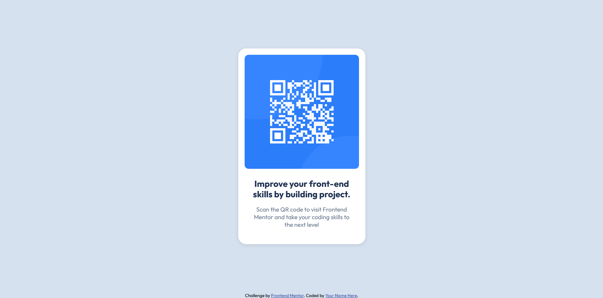

# Frontend Mentor - QR code component solution

This is a solution to the [QR code component challenge on Frontend Mentor](https://www.frontendmentor.io/challenges/qr-code-component-iux_sIO_H). Frontend Mentor challenges help you improve your coding skills by building realistic projects. 

## Table of contents

- [Overview](#overview)
  - [Screenshot](#screenshot)
  - [Links](#links)
- [My process](#my-process)
  - [Built with](#built-with)
  - [What I learned](#what-i-learned)
  - [Continued development](#continued-development)
  - [Useful resources](#useful-resources)
- [Author](#author)
- [Acknowledgments](#acknowledgments)

## Overview

### Screenshot



### Links

- Solution URL: [Source Code](https://github.com/OAguilaLira/qr-code-component-main)
- Live Site URL: [See a live demo](https://oaguilalira.github.io/qr-code-component-main/)

## My process

### Built with

- Semantic HTML5 markup
- CSS custom properties
- CSS Grid
- Mobile-first workflow

### What I learned

While working on this project, I strengthened several core HTML and CSS concepts. One of the key takeaways was the proper use of semantic HTML elements to build a clear and accessible structure.

I used tags like <main>, <article>, <figure>, <header>, and <footer>, which improve both code readability and accessibility for screen readers, as well as SEO.

```html
<main>
  <article id="QR-container">
    <figure id="QR-image-container">
      
    </figure>
    <div id="text-zone">
      <header>
        <h3 id="titulo-text-zone">
          Improve your front-end skills by building project.
        </h3>
      </header>
      <p id="parrafo-text-zone">
        Scan the QR code to visit Frontend Mentor and take your coding
        skills to the next level
      </p>
    </div>
  </article>
</main>
```


I also practiced CSS layout techniques, especially using Grid to center the component both vertically and horizontally on the screen. I'm particularly proud of this part of the CSS:

```css
main {
  display: grid;
  place-items: center;
  height: 100vh;
}
```


In addition, I worked on applying styles like rounded corners, soft shadows for depth, and a clean, minimalist color palette. Here's how I styled the card component:

```css
#QR-container {
  width: 320px;
  padding: 16px 16px 40px;
  background-color: white;
  border-radius: 20px;
  box-shadow: 0 2px 8px rgba(0, 0, 0, 0.1);
}
```

I also learned how to properly include external fonts from Google Fonts and made sure to use descriptive alt attributes for images to enhance accessibility.

This project helped me solidify my understanding of semantic structure, responsive layout, and writing clean, accessible code.

### Continued development

Use this section to outline areas that you want to continue focusing on in future projects. These could be concepts you're still not completely comfortable with or techniques you found useful that you want to refine and perfect.

**Note: Delete this note and the content within this section and replace with your own plans for continued development.**

### Useful resources

- [Example resource 1](https://www.example.com) - This helped me for XYZ reason. I really liked this pattern and will use it going forward.
- [Example resource 2](https://www.example.com) - This is an amazing article which helped me finally understand XYZ. I'd recommend it to anyone still learning this concept.

**Note: Delete this note and replace the list above with resources that helped you during the challenge. These could come in handy for anyone viewing your solution or for yourself when you look back on this project in the future.**

## Author

- Website - [Add your name here](https://www.your-site.com)
- Frontend Mentor - [@yourusername](https://www.frontendmentor.io/profile/yourusername)
- Twitter - [@yourusername](https://www.twitter.com/yourusername)

**Note: Delete this note and add/remove/edit lines above based on what links you'd like to share.**

## Acknowledgments

This is where you can give a hat tip to anyone who helped you out on this project. Perhaps you worked in a team or got some inspiration from someone else's solution. This is the perfect place to give them some credit.

**Note: Delete this note and edit this section's content as necessary. If you completed this challenge by yourself, feel free to delete this section entirely.**
